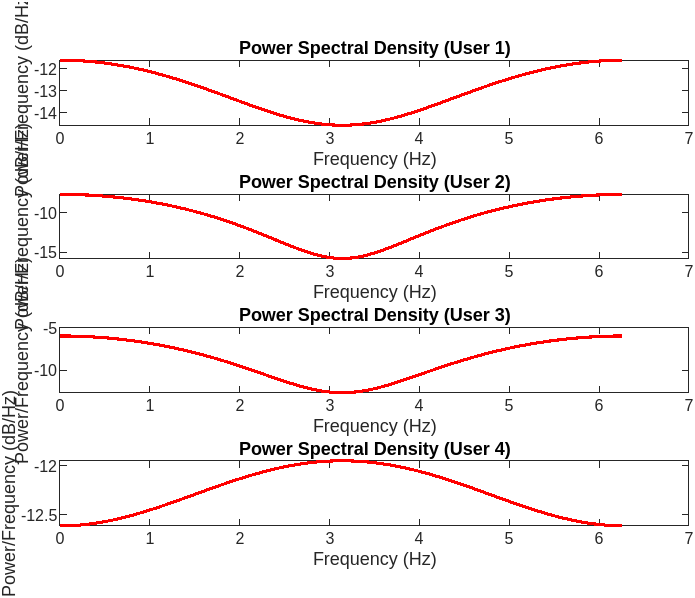
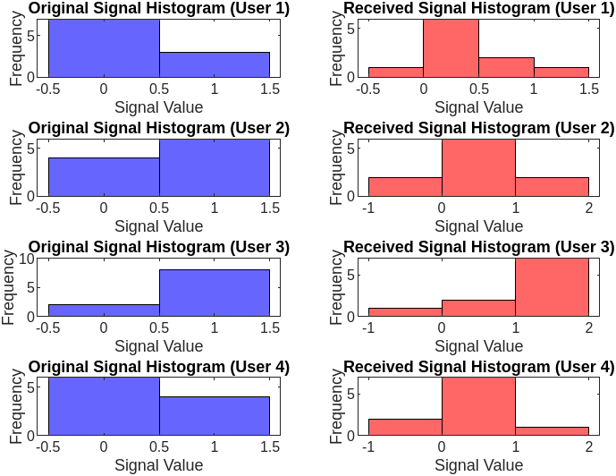

## CDMA Signal Transmission and Reception with Advanced Features

### What is CDMA?
CDMA, or Code Division Multiple Access, is a technique used in telecommunications to allow multiple users to transmit data simultaneously over a shared communication channel. In this MATLAB project, CDMA is implemented by generating spreading codes using the `randi` function.

### Overview
This MATLAB project demonstrates CDMA signal transmission and reception, featuring BER analysis, diversity techniques, and signal visualization.

### Functionality
1. **Input Parameters:**
   - Users input the number of users, bits, and maximum Signal-to-Noise Ratio (SNR) in dB.

2. **Signal Generation:**
   - The spreading codes are sequences of binary digits (0s and 1s) that are assigned to each user. These codes serve two main purposes: spreading the signal over a wider bandwidth and providing a unique signature for each user.
   - The `randi` function is used to randomly generate spreading codes for each user. It takes as input the range of values (0 and 1) and the size of the matrix (number of users by number of bits). By using `randi`, we ensure that the spreading codes are randomly generated, providing each user with a unique code.
   - Once the spreading codes are generated, they are used to modulate the data signals before transmission. During transmission, the modulated signals are spread across the available bandwidth using the assigned spreading codes. At the receiver end, the received signal is despread using the same spreading codes to extract the original data.
   - CDMA allows multiple users to transmit data simultaneously by spreading the signals across a wider bandwidth using unique spreading codes. This enables efficient use of the available spectrum and allows for increased capacity in communication systems without the need for separate frequency channels for each user.

3. **Simulation:**
   - Signals are transmitted and received across various SNR levels.
   - BER is calculated and plotted against SNR.
   - Optimal SNR with minimum BER is determined.
   - SNR is calculated from received signals.

4. **Signal Visualization:**
   - Original and received signals are plotted together for optimal SNR.
     
     
   - Power Spectral Density (PSD) and histograms of signals are visualized.
     
     

5. **Diversity Techniques:**
   - Maximal Ratio Combining (MRC) is applied to improve signal reception.

### Objective
This project aims to understand CDMA system performance under different SNR levels by analyzing BER, exploring diversity techniques, and visualizing signal characteristics.

### Unique Features
1. **BER Analysis:** Provides insights into CDMA system BER performance under varying SNR conditions.
   
2. **Signal Visualization:** Offers visual representations of original and received signals for better understanding.

3. **Diversity Techniques:** Implements MRC to enhance signal reception in noisy environments.

### Examples
Suppose 10 users transmit 100 bits each with a maximum SNR of 20 dB. This project can analyze BER and visualize signal characteristics for this scenario.

### Real-Life Applications
CDMA is widely used in communication systems like cellular networks, satellite communication, and wireless LANs.

### Future Aspects
Future enhancements may include implementing other diversity techniques like Selection Combining (SC) and Equal Gain Combining (EGC), integrating advanced modulation schemes, and optimizing for large-scale CDMA systems.

### How to Use
1. Input desired parameters.
2. Run MATLAB script `project_ADC_CDMA_advanced.m`.
3. Analyze generated plots and output data for insights.

Feel free to customize the code for specific scenarios or additional features.

### Contributor
- [Arijit Mondal](https://github.com/ariktheone) - [ariktheone](https://github.com/ariktheone)
  
As a student, this project aims to provide practical insights into CDMA systems and their performance analysis.
